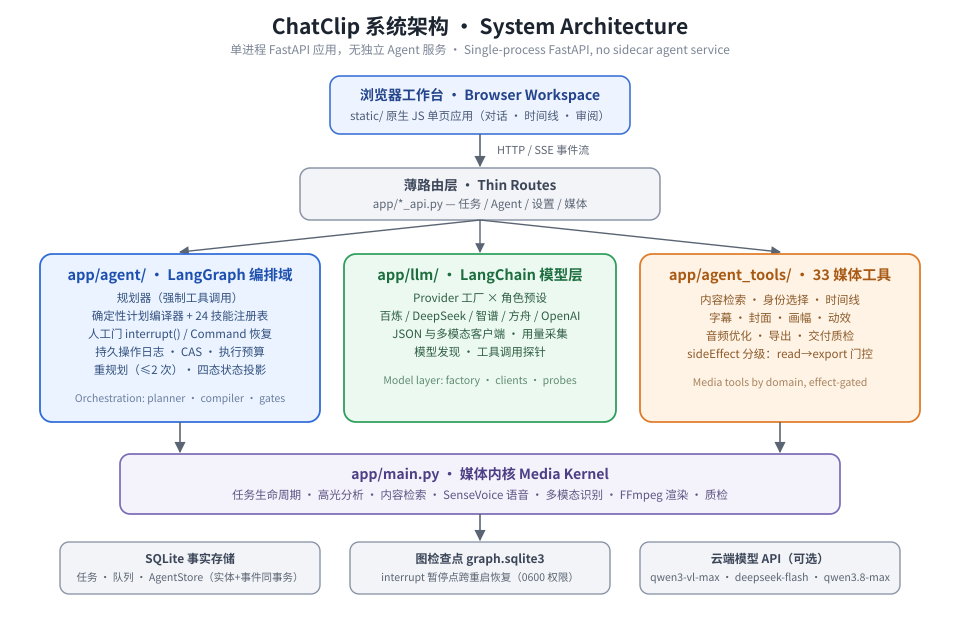
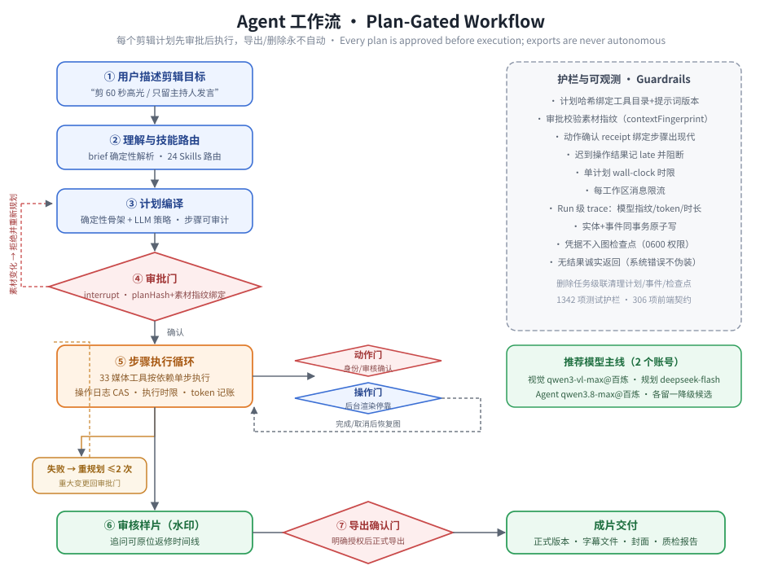

<div align="center">

# ChatClip

**A plan-gated AI agent that turns natural language into finished video cuts.**

Describe the edit you want. ChatClip watches the footage, drafts an executable
plan, waits for your approval, and drives every cut, subtitle, cover and
export — always inside guardrails you control.

[Quick Start](#-quick-start) · [How It Works](#-how-it-works) · [Architecture](#-architecture) · [Models](#-models)

`Python 3.10+` `LangGraph` `LangChain` `FastAPI` `SenseVoice` `FFmpeg`

[](./LICENSE)
[](#-verification)

[简体中文](./README.md) · **English**

</div>

---

## Why ChatClip

Timeline editors make *you* do the mechanical work. ChatClip flips the
division of labor: you stay the director, the agent becomes the editing crew.

- **Say it, don't slice it** — "make a 60-second highlight", "cut the part
  where they explain pricing", "keep only the host speaking". The agent
  retrieves the right moments and assembles the cut.
- **Nothing runs without your sign-off** — every job starts with a readable
  plan (what the agent understood, which tools it will call, in what order).
  Timeline drafts, subtitle reviews, covers and formal exports each stop at
  an explicit confirmation gate. Exports and deletions are never autonomous.
- **Evidence, not vibes** — multimodal retrieval (speech transcript, visual
  embeddings, OCR, speaker diarization) grounds every proposed cut in source
  footage you can inspect, with no-result honesty when nothing matches.
- **Local-first media stack** — ASR, embeddings, recognition and rendering
  run on your machine; only three optional cloud model roles for vision,
  planning and tool-calling.

### System Architecture

<div align="center">
  
</div>

### Plan-Gated Workflow

<div align="center">
  
</div>

## How It Works

The two diagrams above give the full picture; step by step:

1. **Upload & describe** — drop a video, type the edit you want.
2. **Understand** — a deterministic parser extracts duration targets, source
   ranges, anchors and deliverables from your sentence; a skill router picks
   the editing playbook (24 built-in Skills: highlight, topic, face-matched,
   voiceprint, short-form hook, cover, social reframe, delivery QC…).
3. **Plan** — the agent compiles an auditable step plan. For built-in skills
   the skeleton is compiled deterministically from facts; the LLM contributes
   strategy, never invents steps.
4. **Approve** — the plan (bound to a hash of your material state) waits for
   you. Material changed while you read? Approval is refused; replan.
5. **Execute under guardrails** — 33 media tools run one step at a time.
   Long renders park on a durable operation journal; a wall-clock deadline
   bounds every plan; token usage, replans and error classes are recorded.
6. **Review & iterate** — watermarked preview first, formal export only on
   explicit confirmation. Follow-ups ("shorter", "start from pricing")
   revise the timeline in-place.

## Architecture

See the **System Architecture** and **Plan-Gated Workflow** diagrams above.
Highlights:

- One FastAPI process hosts everything — no sidecar agent service
- Plans live in a checkpointed LangGraph state machine: `interrupt()` pauses
  for approval, review confirmations and background renders;
  `Command(resume=…)` continues them across restarts
- Entity writes and audit events commit in one transaction; credentials
  never enter graph checkpoints
- Deep dive: [`docs/ARCHITECTURE.md`](./docs/ARCHITECTURE.md)

## Models

| Role | Recommended | Fallback |
|---|---|---|
| Vision (VLM) | `qwen3-vl-max` @ Alibaba Bailian | `doubao-seed-2.0` @ Volcengine Ark |
| Edit planning | `deepseek-flash` @ DeepSeek | `qwen3.8-max` @ Bailian |
| Agent tool-calling | `qwen3.8-max` @ Alibaba Bailian | `glm-4.6` @ Zhipu BigModel |

Two accounts cover the whole line. Everything else — SenseVoice ASR,
SigLIP/E5/CLAP embeddings, OCR, person recognition, optional TalkNet
active-speaker detection — runs locally.

## Quick Start

**Prerequisites** — x86-64 Linux/WSL2 · Python 3.10–3.11 · Node 22 (motion
renderer only) · FFmpeg with `libx264` + `drawtext` · ≥10 GiB disk.

```bash
git clone https://github.com/LittleSongxx/ChatClip.git
cd ChatClip

python3 tools/setup.py --profile auto    # guided install, CPU/GPU auto-detect
cp .env.example .env                     # add your API keys (CHATCLIP_* vars)
./start.sh                               # → http://127.0.0.1:5180
```

Paste your keys over the preselected models in **Settings** (the agent model
must pass a live tool-calling probe), upload a video, and describe your cut.

<details>
<summary><b>Docker</b></summary>

```bash
cp .env.example .env      # fill model keys
docker compose up --build -d                       # CPU
docker compose -f docker-compose.yml -f docker-compose.gpu.yml up --build -d   # GPU
```
</details>

<details>
<summary><b>Configuration</b></summary>

All variables use the `CHATCLIP_*` / `VISION_*` / `LLM_*` / `AGENT_*`
prefixes — see [`.env.example`](./.env.example) and the full reference in
[`docs/environment.example`](./docs/environment.example). Highlights:

- `CHATCLIP_AGENT_PLAN_DEADLINE_SECONDS` — wall-clock budget per plan
- `CHATCLIP_AGENT_MAX_MESSAGES_PER_10MIN` — per-workspace rate limit
- `CHATCLIP_ACTIVE_SPEAKER_MODE` — optional TalkNet integration
</details>

## Verification

```bash
python -m pytest -q                # 1342 backend tests
npm run test:frontend              # 306 browser/contract tests
npm run test:agent-scenarios       # agent gate (scenarios + hardening + budgets)
python3 tools/doctor.py            # environment check
```

## Project Layout

```
app/agent/        LangGraph orchestration (graph, planner, compiler, gates)
app/agent_tools/  33 media tool handlers by domain
app/llm/          LangChain model layer (providers, clients)
app/main.py       media kernel (jobs, analysis, rendering, QC)
static/           vanilla-JS workspace UI
skills/           24 editing Skills (SKILL.md policy documents)
tools/            installer, doctor, validators, benchmarks
tests/            1342 tests incl. browser suite
```

## Roadmap

- [ ] Real-video evaluation dataset & public benchmark report
- [ ] Speaker/face identity persistence across sessions
- [ ] More delivery targets (platform-specific packages)
- [ ] Multi-source projects (combine several uploads)

## License

Released under the [Non-Commercial Attribution License](./LICENSE).

<div align="center">

**If ChatClip saves you an afternoon of scrubbing timelines, a ⭐ pays it forward.**

</div>
